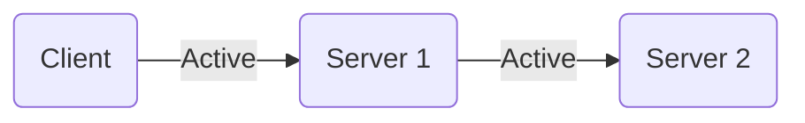
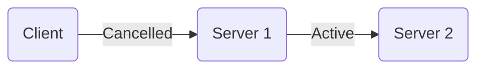
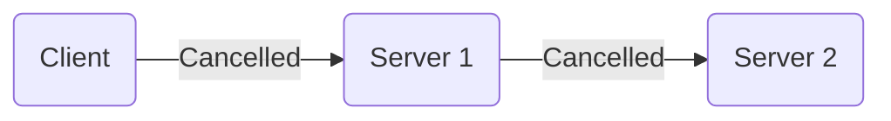
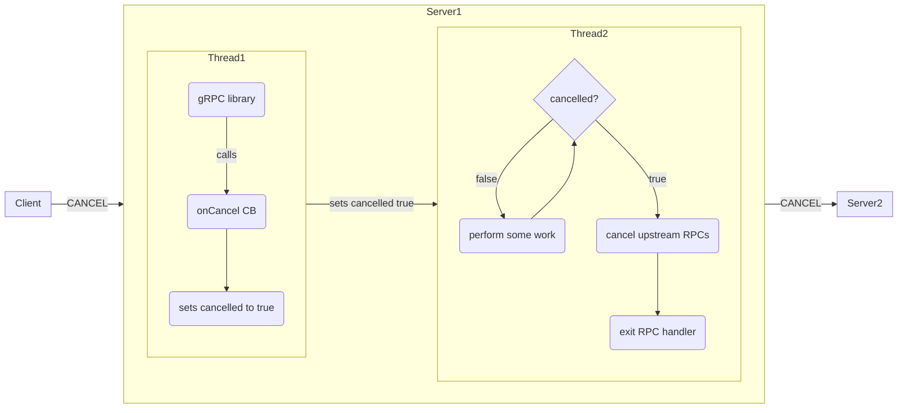

### Overview

When a gRPC client is no longer interested in the result of an RPC call, it may
_cancel_ to signal this discontinuation of interest to the server.  After that
point, the server should stop any ongoing computation and end its side of the
connection. Often, servers are also clients to upstream servers, so that
cancellation operation should ideally propagate to all ongoing computation in
the system that was initiated due to the original client RPC call.

A client may cancel an RPC for several reasons. Perhaps the data it requested
has been made irrelevant. Perhaps you, as the client, want to be a good citizen
of the server and are conserving compute resources.

### Cancelling an RPC Call on the Client Side

A client cancels an RPC call by calling a method on the call object or, in some
languages, on the accompanying context object. At the level of the wire
protocol, a client cancels an RPC call by sending an
[`RST_STREAM`](https://datatracker.ietf.org/doc/html/rfc7540#section-6.4) frame
with an error code of
[`CANCEL(8)`](https://datatracker.ietf.org/doc/html/rfc7540#section-7). gRPC
clients do not provide additional details to the server about the reason for the
cancellation. When the server receives this frame, the application-provided
server handler may be busy processing the request in a thread, coroutine, or
other unit of concurrency. The gRPC library in general does not have a mechanism
to interrupt the server handler, so the server handler must coordinate with the
gRPC library to ensure that local processing of the request ceases and any
upstream RPC calls initiated in service of this RPC call are themselves
cancelled.

The exact mechanism for notifying the server handler that the RPC being handled
has been cancelled differs between languages. In some languages, the mechanism
is a callback function that the server handler registers with the gRPC library
which will be called when a cancellation is received. This callback is expected
to coordinate with the handler thread/coroutine to stop local processing on
behalf of the request and clean up any associated resources, including upstream
RPCs. In other languages, the mechanism may be a multithreading Event object,
which will be set when the RPC has been cancelled.  Regardless of the
language-specific mechanism, the thread/coroutine processing the RPC must
periodically check if RPC has been cancelled and if it has, cease processing and
begin the clean-up process.

### Language Support

| Language | Example        | Notes                            |
|----------|----------------|----------------------------------|
| Java     |[Example](https://github.com/grpc/grpc-java/tree/master/examples/src/main/java/io/grpc/examples/cancellation)||
| Go       |[Example](https://github.com/grpc/grpc-go/tree/master/examples/features/cancellation)||
| C++      |Upcoming||
| Python | [Example](https://github.com/grpc/grpc/tree/master/examples/python/cancellation)||