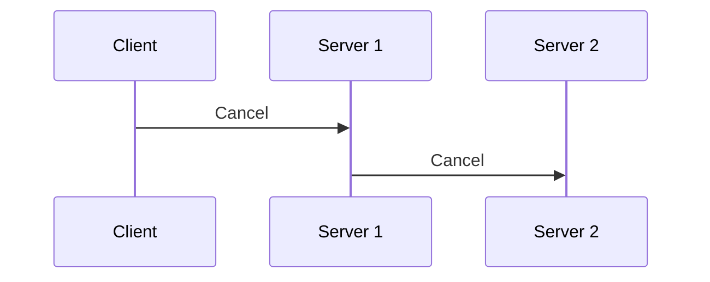
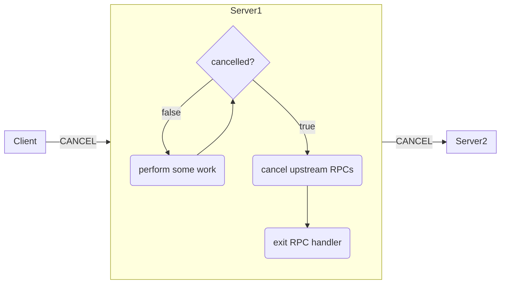

### Overview

When a gRPC client is no longer interested in the result of an RPC call, it may
_cancel_ to signal this discontinuation of interest to the server.
[Deadline](/docs/guides/deadlines/) expiration and I/O errors
also trigger cancellation.  When an RPC is cancelled, the server should stop
any ongoing computation and end its side of the stream. Often, servers are also
clients to upstream servers, so that cancellation operation should ideally
propagate to all ongoing computation in the system that was initiated due to
the original client RPC call.

A client may cancel an RPC for several reasons. The data it requested may have
been made irrelevant or the author of the client may want to be a good citizen
of the server and conserve compute resources.

### Cancelling an RPC Call on the Client Side

A client cancels an RPC call by calling a method on the call object or, in some
languages, on the accompanying context object. While gRPC clients do not
provide additional details to the server about the reason for the cancellation,
the cancel API call takes a string describing the reason, which will result in
a client-side exception and/or log containing the provided reason. When a
server is notified of the cancellation of an RPC, the application-provided
server handler may be busy processing the request. The gRPC library in general
does not have a mechanism to interrupt the application-provided server handler,
so the server handler must coordinate with the gRPC library to ensure that
local processing of the request ceases.  Therefore, if an RPC is long-lived,
its server handler must periodically check if the RPC it is servicing has been
cancelled and if it has, cease processing.  Some languages will also
support automatic cancellation of anyoutgoing RPCs, while in others, the author
of the server handler is responsible for this.

### Language Support

| Language | Example        | Notes                            |
|----------|----------------|----------------------------------|
| Java     |[Example](https://github.com/grpc/grpc-java/tree/master/examples/src/main/java/io/grpc/examples/cancellation)|Automatically cancels outgoing RPCs|
| Go       |[Example](https://github.com/grpc/grpc-go/tree/master/examples/features/cancellation)|Automatically cancels outgoing RPCs|
| C++      |[Example](https://github.com/grpc/grpc/tree/master/examples/cpp/cancellation)|Automatically cancels outgoing RPCs|
| Python | [Example](https://github.com/grpc/grpc/tree/master/examples/python/cancellation)||
