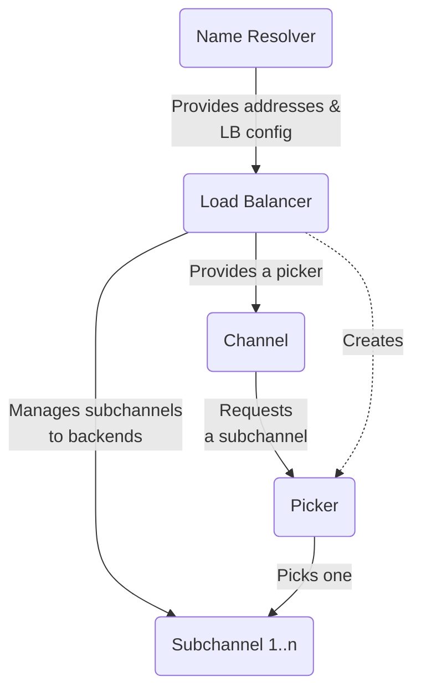


### Overview

One of the key features of gRPC is load balancing, which allows requests from
clients to be distributed across multiple servers. This helps prevent any
one server from becoming overloaded and allows the system to scale up by adding
more servers.

A gRPC load balancing policy is given a list of server IP addresses by the name
resolver. The policy is responsible for maintaining connections (subchannels)
to the servers and picking a connection to use when an RPC is sent.

### Implementing Your Own Policy

By default the `pick_first` policy will be used. This policy actually does no
load balancing but just tries each address it gets from the name resolver and
uses the first one it can connect to. By updating the gRPC service config you
can also switch to using `round_robin` that connects to every address it gets
and rotates through the connected backends for each RPC. There are also some
other load balancing policies available, but the exact set varies by language.
If the built-in policies do not meet your needs you can also implement your own
custom policy.

This involves implementing a load balancer interface in the language you are
using. At a high level, you will have to:

- Register your implementation in the load balancer registry so that it can
be referred to from the service config
- Parse the JSON configuration object of your implementation. This allows your
load balancer to be configured in the service config with any arbitrary JSON
you choose to support
- Manage what backends to maintain a connection with
- Implement a `picker` that will choose which backend to connect to when an
RPC is made. Note that this needs to be a fast operation as it is on the RPC
call path
- To enable your load balancer, configure it in your service config

The exact steps vary by language, see the language support section for some
concrete examples in your language.

### Backend Metrics

What if your load balancing policy needs real-time information about the 
backend servers? For this you can rely on backend metrics. You can
have metrics provided to you either in-band, in the backend RPC responses, or
out-of-band as separate RPCs from the backends. Standard metrics like 
CPU and memory utilization are provided, but you can also implement 
your own custom metrics.

For more information on this, please see the custom backend metrics [guide][custom backend metrics guide]

### Service Mesh

If you have a service mesh setup where a central control plane is coordinating
the configuration of your microservices, you cannot configure your custom load
balancer directly via the service config. But support is provided to do this
with the xDS protocol that your control plane uses to communicate with your
gRPC clients. Please refer to your control plane documentation to determine how
custom load balancing configuration is supported.

For more details, please see gRPC [proposal A52].

### Language Support

| Language | Example        | Notes                            |
|----------|----------------|----------------------------------|
| Java     | [Java example] |                                  |
| Go       | [Go example]   |                                  |
| C++      |                | Not yet supported                |

[proposal A52]:https://github.com/grpc/proposal/blob/master/A52-xds-custom-lb-policies.md
[Java example]: https://github.com/grpc/grpc-java/tree/master/examples/src/main/java/io/grpc/examples/customloadbalance 
[Go example]: https://github.com/grpc/grpc-go/tree/master/examples/features/customloadbalancer
[custom backend metrics guide]: /docs/guides/custom-backend-metrics/
