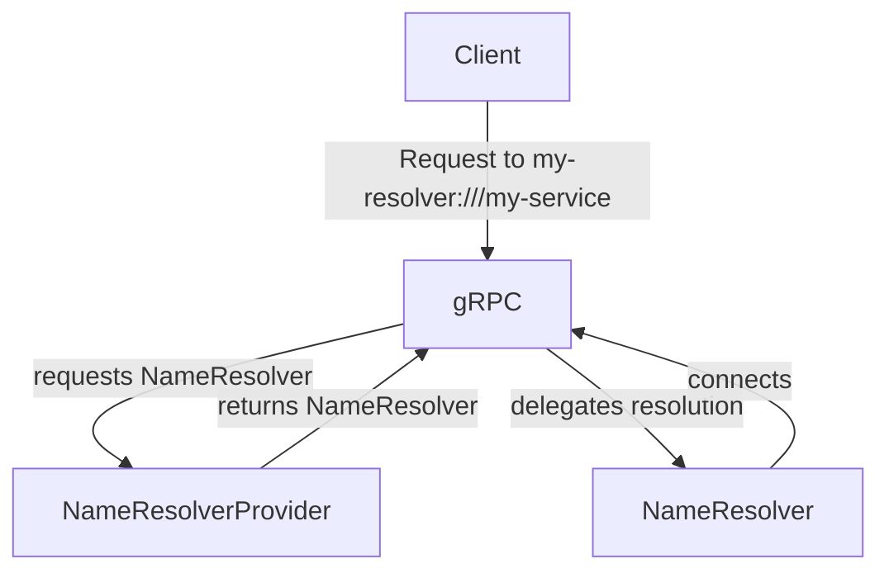

### Overview

Name resolution is fundamentally about service discovery. When sending a request
to `grpc.io`, the client must determine the IP address of that service name.
Name resolution is often thought to be the same as
[DNS](https://www.ietf.org/rfc/rfc1035.txt). In practice however, DNS is usually
augmented with extensions or completely replaced to enable name resolution.  For
example, the `/etc/hosts` file on Posix systems is not strictly speaking part of
DNS and instead stems from
[RFC-952](https://datatracker.ietf.org/doc/html/rfc952).

When making a request with a gRPC client, by default, DNS name resolution is
used. However, various other name resolution mechanisms may be used:

|Resolver|Example|Notes|
|-|-|-|
|DNS|`grpc.io:50051`|By default, DNS is assumed.|
|DNS|`dns:///grpc.io:50051`|The extra slash is used to provide an authority|
|Unix Domain Socket|`uds:///var/run/docker.sock`|
|xDS|`xds:///wallet.grpcwallet.io`||
|IPv4|`ipv4:198.51.100.123:50051`|Only supported in some languages|

The triple slashes above (`///`) may look unfamiliar if you are used to the
double slashes of HTTP, such as `https://grpc.io`. These _target strings_ follow
the format for [RFC-3986](https://datatracker.ietf.org/doc/html/rfc3986) URIs.
The string following the first two slashes and preceding the third (if there is
a third at all) is the _authority_. The authority string identifies a server
which _has_ authority over the URI that follows. In the case of a conventional
HTTP request, the authority over the URI is the server to which the request will
be sent. In other cases, the authority will be the identity of the name
resolution server, while the resource itself lives on some other server. Some
name resolvers have no need for an authority, such as the xDS resolver. In this
case, the authority string is left empty, resulting in three slashes in a row.

Several languages support an interface to allow the user to define their own
name resolver, so that you may define how to resolve any given name. Once
registered, a name resolver with the _scheme_ `my-resolver` will be picked up
when a target string begins with `my-resolver:`. For example, requests to
`my-resolver:///my-service` would now use the `my-resolver` name resolver
implementation.

### Custom Name Resolvers

You might consider using a custom name resolver whenever you would like to
augment or replace DNS for service discovery. This interface has been used in
the past to use [Apache Zookeeper](https://zookeeper.apache.org/) to look up
service names.  It has also been used to directly interface with the Kubernetes
API server for service lookup based on headless Service resources.

One reason why it might be particularly useful to use a customer name resolver
rather than standard DNS is that this interface is _reactive_. Within standard
DNS, a client looks up the address for a particular service at the beginning of
the connection and maintains its connection to that address for the lifetime
of the connection. However, custom name resolvers may be watch-based. That is,
they may maintain a connection to the name server for the duration of the
connection and respond intelligently to backend failure as well as backend
scale-ups and backend scale-downs.

In addition, a custom name resolver may provide the client connection with a
_service config_. A service config is essentially a JSON object that defines
arbitrary configuration specifying how traffic should be routed to and load
balanced across a particular service. At its most basic, this can be used to
specify things like that a particular service should use the round robin load
balancing policy vs. pick first. However, when a custom name resolver is used in
conjunction with arbitrary service config and a [_custom load balancing
policy_](https://grpc.io/docs/guides/custom-load-balancing/), very complex
traffic management systems such as xDS may be constructed.

#### Life of a Target String

While the exact interface for custom name resolvers differs from language to
language, the general structure is the same. The client registers an
implementation of a _name resolver provider_ to a process-global registry close
to the start of the process. The name resolver provider will be called by the
gRPC library with target strings intended for it. Given that target string, the
name resolver provider will return an instance of a name resolver, which will
interact with the client connection to direct the request according to the
target string.

### Language Support

| Language | Example        | Notes                            |
|----------|----------------|----------------------------------|
| Java     |[Example](https://github.com/grpc/grpc-java/tree/master/examples/src/main/java/io/grpc/examples/nameresolve)||
| Go       |[Example](https://github.com/grpc/grpc-go/tree/master/examples/features/name_resolving)||
| C++      | Not supported||
| Python |Not supported||
