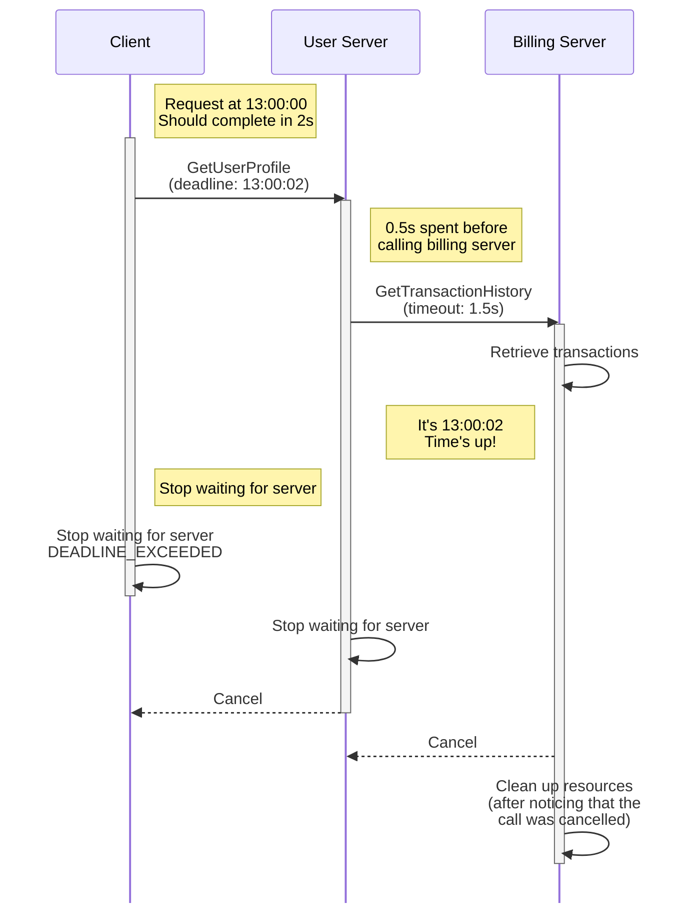

### Overview

A deadline is used to specify a point in time past which a client is unwilling
to wait for a response from a server. This simple idea is very important in
building robust distributed systems. Clients that do not wait around
unnecessarily and servers that know when to give up processing requests will
improve the resource utilization and latency of your system.

Note that while some language APIs have the concept of a __deadline__, others
use the idea of a __timeout__. When an API asks for a deadline, you provide a
point in time which the call should not go past. A timeout is the max duration
of time that the call can take. A timeout can be converted to a deadline by
adding the timeout to the current time when the application starts a call. For
simplicity, we will only refer to deadline in this document.

### Deadlines on the Client

By default, gRPC does not set a deadline which means it is possible for a
client to end up waiting for a response effectively forever. To avoid this you
should always explicitly set a realistic deadline in your clients. To determine
the appropriate deadline you would ideally start with an educated guess based on
what you know about your system (network latency, server processing time, etc.),
validated by some load testing.

If a server has gone past the deadline when processing a request, the client
will give up and fail the RPC with the `DEADLINE_EXCEEDED` status. 

### Deadlines on the Server

A server might receive RPCs from a client with an unrealistically short
deadline that would not give the server enough time to ever respond in time.
This would result in the server just wasting valuable resources and in the worst
case scenario, crash the server. A gRPC server deals with this situation by
automatically cancelling a call (`CANCELLED` status) once a deadline set by the
client has passed.

Please note that the server application is responsible for stopping any activity
it has spawned to service the RPC. If your application is running a
long-running process you should periodically check if the RPC that initiated
it has been cancelled and if so, stop the processing.

#### Deadline Propagation

Your server might need to call another server to produce a response. In these
cases where your server also acts as a client you would want to honor the
deadline set by the original client. Automatically propagating the deadline from
an incoming RPC to an outgoing one is supported by some gRPC
implementations. In some languages this behavior needs to be explicitly
enabled (e.g. C++) and in others it is enabled by default (e.g. Java and Go).
Using this capability lets you avoid the error-prone approach of manually
including the deadline for each outgoing RPC.

Since a deadline is set point in time, propagating it as-is to a server can be
problematic as the clocks on the two servers might not be synchronized. To
address this gRPC converts the deadline to a timeout from which the already
elapsed time is already deducted. This shields your system from any clock skew
issues.

### Language Support

| Language | Example          |
|----------|------------------|
| Java     | [Java example]   |
| Go       | [Go example]     |
| C++      |                  |
| Python   | [Python example] |

[Java example]: https://github.com/grpc/grpc-java/tree/master/examples/src/main/java/io/grpc/examples/deadline

[Go example]: https://github.com/grpc/grpc-go/tree/master/examples/features/deadline

[Python example]: https://github.com/grpc/grpc/tree/master/examples/python/timeout

### Other Resources

- [Deadlines blogpost]

[Deadlines blogpost]: https://grpc.io/blog/deadlines/
