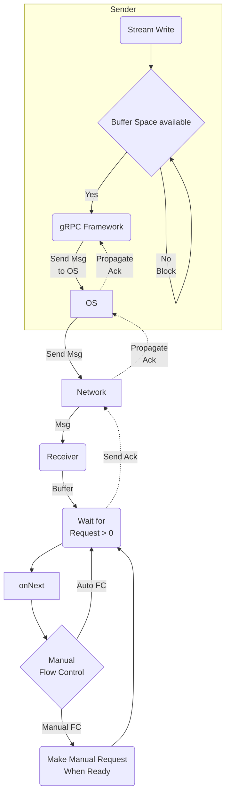

### Overview

Flow control is a mechanism to ensure that a receiver of messages does not get
overwhelmed by a fast
sender.

Flow control prevents data loss, improves performance and increases reliability.
gRPC utilizes the
underlying transport (ex. netty, golang, node, cronet) for the implementation of
HTTP/2 sliding
window flow control. As data is read on the receiving side, an acknowledgement
is returned to the
sender. Acknowledgements are handled out of band; they are not using up slots
from manual requests.
As each acknowledgement is processed, that space is restored to the send
window's available size.

Even if you don't do anything, for network performance reasons, there will be
transport level flow control using [Bandwidth-delay product][bdp] which can
cause your writes to
block.

Note: large messages are broken up into smaller (ex. 16KB) chunks at the network
layer which
allows messages to be larger than the sliding window.

In gRPC, when a value is written to a stream, that does not mean that it has
gone out over the
network. Rather, that it has been passed to the framework which will now take
care of the nitty
gritty details of buffering it and sending it to the OS on its way over the
network. When the
buffer is full, the stream will be marked as not ready and any further writes on
that stream will
block until buffer space becomes available.

The flow is the same for writing from a Server to a Client as when a Client
writes to a Server

In languages where the gRPC implementation uses asynchronous callbacks for
incoming stream
processing, the default approach is to always have a request for 1 value
outstanding so that as
requests come in they are automatically handled one at a time. You can override
this behavior with
manual flow control. The most common use case it to avoid having your
asynchronous onNext method have to
block when processing of the read message is being done somewhere else.

### Incoming Manual Flow Control

If you may have a buffer where your onNext places values from the stream, then
you will want to do
flow control to avoid buffer overflows. You could use a blocking buffer, but you
may not want to
have the thread being used by onNext to block. Another way of handling this is
to use manual flow
control.

By default, gRPC will configure a stream to request one value at startup and
then at the completion
of each "onNext" invocation requests one more message. You can take control of
this in a language
specific manner by disabling AutoRequest on the request stream. If you do so,
then you are
responsible for asynchronously telling the stream each time that you would like
a new message to be
asynchronously sent to onNext when one is available. This is done by calling a
method on the
request stream requesting messages (while this has a count, generally you
request 1). Putting this
request at the end of your onNext method essentially duplicates the default
behavior.

Note: there is the potential for a deadlock if both the client and server are
using manual flow
control and both try to do a lot of writing without doing any reads.

### Outgoing Flow Control

The underlying layer (such as netty) will apply backpressure when there is no
space to write the
next message chunk. This causes the request stream to go into a not ready state
and the outgoing
onNext method invocation blocks. You can explicitly check that the stream is
ready for writing
before calling onNext to avoid blocking. You can utilize this to start doing
reads which may allow
the other side of the channel to complete a write and then to do its own reads
thereby avoiding
deadlock.

### Language Support

| Language | Example          | Notes                              |
|----------|------------------|------------------------------------|
| Java     | [Java Example][] |                                    |
| Go       |                  | Example upcoming                   |
| C++      |                  | Example upcoming                   |
| Node     |                  | Example upcoming                   |
| Python   |                  | Normal case is manual flow control |

#### Java

##### <u>Client side (server or bidi streaming)</u>

In the `ClientResponseObserver.beforeStart` method, call
`requestStream.disableAutoRequestWithInitial(1)`

When you are ready to begin processing the next value from the stream call
`requestStream.request(1)`

A minor use case for manual flow control is when there are lots of small
messages and you are using
netty. To avoid switching back and forth between the application and network
threads, you can
specify a larger initial value (such as 5) so that the application thread can
have values waiting
for it rather than constantly having to block and wait for the network thread to
provide the next
value.

##### <u>Server side (client or bidi streaming)</u>

In your stub methods supporting streaming add at the top

1. cast `StreamObserver<> responseObserver`
   to `ServerCallStreamObserver<> serverCallStreamObserver`
1. call `serverCallStreamObserver.disableAutoRequest()`

When you are ready to begin processing the next value from the stream call
`serverCallStreamObserver.request(1)`

#### C++

The following classes are used for flow control in gRPC:

* **ClientCallStreamObserver**: This class represents the client-side stream
  observer for a gRPC call. The client-side stream observer is used to send
  messages to the server.
* **ServerCallStreamObserver**: This class represents the server-side stream
  observer for a gRPC call. The server-side stream observer is used to receive
  messages from the client.
* **FlowController**: This class represents the flow controller for a gRPC call.
  The flow controller is used to manage the flow of data between the client and
  the server.

#### Python

All streaming reads (both client and server) use iterators which only retrieve
the next value from
the lower layers when the iterator is advanced. Thus, it is inherently doing
manual flow control.
No special processing is required.

[Java Example]: https://github.com/grpc/grpc-java/tree/master/examples/src/main/java/io/grpc/examples/manualflowcontrol

[bdp]: https://en.wikipedia.org/wiki/Bandwidth-delay_product

