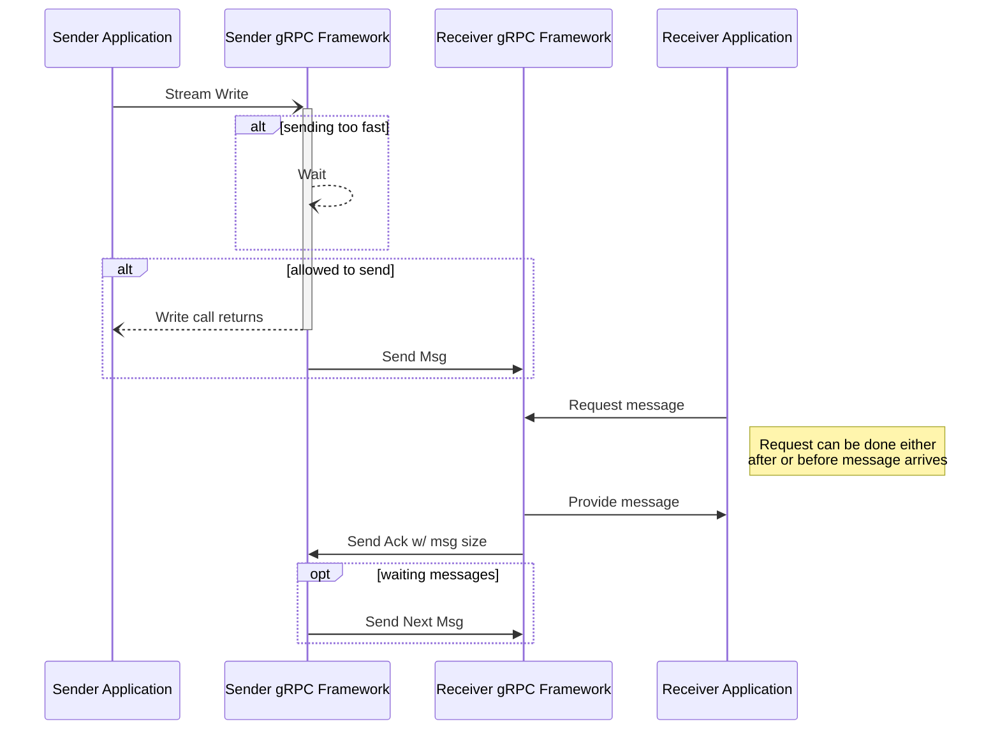

### Overview

Flow control is a mechanism to ensure that a receiver of messages does not get
overwhelmed by a fast sender.  Flow control prevents data loss, improves
performance and increases reliability.  It applies to streaming
RPCs and is not relevant for unary RPCs.  By default, gRPC handles the
interactions with flow control for you, though some languages allow you to
override the default behavior and take explicit control.

gRPC utilizes the underlying transport to detect when it is safe to send more
data. As data is read on the receiving side, an acknowledgement
is returned to the sender letting it know that the receiver has more capacity.

As needed, the gRPC framework will wait before returning from a write call.  In 
gRPC, when a value is written to a stream, that does not mean that it has
gone out over the network. Rather, that it has been passed to the framework
which will now take care of the nitty gritty details of buffering it and sending
it to the OS on its way over the network. 

{}
  The flow is the same for writing from a Server to a Client as when a Client
writes to a Server
{}

{}
There is the potential for a deadlock if both the client and server are
doing synchronous reads or using manual flow control and both try to do a lot
of writing without doing any reads.
{}

### Language Support

| Language | Example          | 
|----------|------------------|
| Java     | [Java Example][] |

[Java Example]: https://github.com/grpc/grpc-java/tree/master/examples/src/main/java/io/grpc/examples/manualflowcontrol

