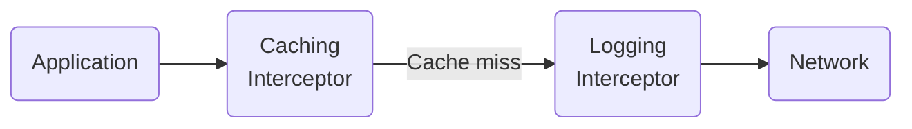
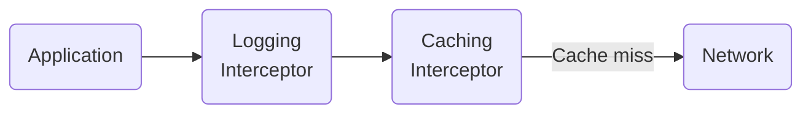

### Overview

The core of making gRPC services is implementing RPC methods. But some
functionality is independent of the method being run and should apply to all or
most RPCs. Interceptors are well suited to this task.

### When to Use Interceptors

You may already be familiar with the concept of interceptors, but may be used to
calling them "filters" or "middleware." Interceptors are very well suited to
implementing logic that is not specific to a single RPC method. They are also
easy to share across different clients or servers. Interceptors are an important
and frequently-used way to extend gRPC. You might find some functionality you
want is already available as an interceptor in the wider gRPC ecosystem.

Some example use cases for interceptors are:

 * [Metadata](/docs/guides/metadata/) handling
 * Logging
 * Fault injection
 * Caching
 * Metrics
 * Policy enforcement
 * Server-side Authentication
 * Server-side Authorization

{}
While _client-side_ authentication could be done via an interceptor, gRPC
provides a specialized "call credentials" API that is better suited to the task.
See the [Authentication Guide](/docs/guides/auth/) for details about client-side
authentication.
{}

### How to Use Interceptors

Interceptors can be added when building a gRPC channel or server. The
interceptor is then called for every RPC on that channel or server. The
interceptor APIs are different for client-side than server-side, so an
interceptor will either be a "client interceptor" or a "server interceptor."

Interceptors are inherently per-call; they are not useful for managing TCP
connections, configuring the TCP port, or configuring TLS. While the proper tool
for most customization, they can't be used for everything.

#### Interceptor Order

When using multiple interceptors, their order is significant. You'll want to
make sure to understand the order your gRPC implementation will execute them. It
is useful to think about the interceptors as being in a line between the
application and the network. Some interceptors will be "closer to the network"
and have more control over what is sent and others will be "closer to the
application" which have a better view into the application's behavior.

Suppose you have two client interceptors: a caching interceptor and a logging
interceptor. What order should they be in? You might want the logging
interceptor closer to the network to better monitor your application's
communication and ignore cached RPCs:

Or you might want it closer to the application to understand your app's behavior
and see what information it is loading:

You can choose between these options by just changing the order of the
interceptors.

### Language Support

| Language | Example          |
|----------|------------------|
| C++      | [C++ example]    |
| Go       | [Go example]     |
| Java     | [Java example]   |
| Python   | [Python example] |

[C++ example]: https://github.com/grpc/grpc/tree/master/examples/cpp/interceptors
[Go example]: https://github.com/grpc/grpc-go/tree/master/examples/features/interceptor
[Java example]: https://github.com/grpc/grpc-java/tree/master/examples/src/main/java/io/grpc/examples/header
[Python example]: https://github.com/grpc/grpc/tree/master/examples/python/interceptors
