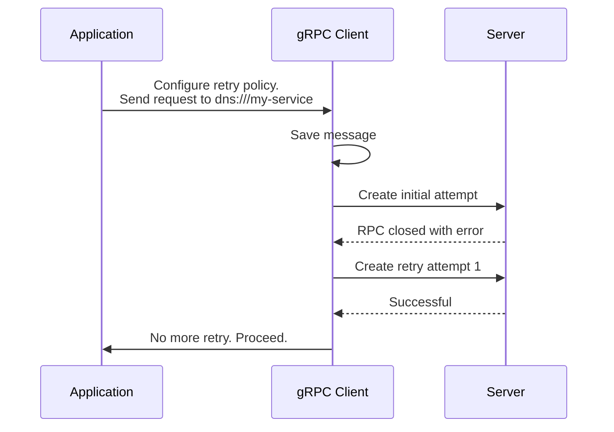

### Overview

Retries are a key pattern for making services more reliable. By re-attempting failed operations, applications can overcome temporary issues like network or server glitches. This is essential for modern cloud applications to handle the inevitable transient faults that occur.

For the best practice, applications should understand what failed operations are suitable for retry, define exponential backoff parameters for retry delay, determine the number of retry attempts, and also monitor retry metrics.


### How gRPC client retry works

gRPC’s built-in retry logic saves the call's history for potential retries and monitors RPC events. Even if there is no retry policy configured, gRPC still saves the call's history in case it needs to perform transparent retry (discussed in a later section). Note that ‘retry’ means replacing a failed call with a new call and replaying the call's history on that newly created call.

If certain criteria are met – the RPC closes with a failure status code matching the retry policy's retryable status codes and remains within the retry attempt limit – gRPC will create a new retry stream after an exponential backoff delay.

gRPC also supports other features like retry throttling and server push back. See [gRFC for client side retry] for further details.

Once the response header is received, the RPC is committed. No further retries will be attempted, and gRPC hands over the RPC to the application.

The graph below shows architectural overview of gRPC retry internal.




### Retry configuration
Retries are enabled by default, but there is no default retry policy. Without a retry policy, gRPC cannot safely retry RPCs in most cases. Only RPCs that failed due to low-level races are retried, and only if gRPC is certain the RPCs have not been processed by a server. This is known as "transparent retry." You can configure a retry policy to allow gRPC to retry RPCs in more circumstances and more aggressively. You can also disable retries entirely when creating a channel, which disables transparent retries and any configured retry policies.

{}
Failure can occur in different stages. Even without an explicit retry policy, gRPC may perform transparent retries. The extent of these retries depends on when the failure happens:
* gRPC may do unlimited transparent retry when RPC never leaves the client.
* gRPC performs a single transparent retry when RPC reaches the gRPC server library, but has never been seen by the server application logic. Be aware of this type of retry, as it adds load to the network.
  {}

You can optimize your application's retry functionality by focusing on key steps and configurations that gRPC supports.
* Max number of retry attempts
* Exponential backoff 
* Set of retryable status codes

Retry is configurable via [gRPC Service Config], at a per-method granularity.
  The configuration contains the following knobs:

```
"retryPolicy": {
  "maxAttempts": 4,
  "initialBackoff": "0.1s",
  "maxBackoff": "1s",
  "backoffMultiplier": 2,
  "retryableStatusCodes": [
    "UNAVAILABLE"
  ]
}
```

Jitter of plus or minus 20% is applied to the backoff delay to avoid hammering servers at the same time from a large number of clients.  In the example configuration above, `initialBackoff` is set to 100ms, so the actual backoff delay after the first attempt will be for a random time period within the range `[80ms, 120ms]`.

gRPC supports throttle limit that prevents server overload due to retries. Below is an examples of retry throttle configuration:

```
"retryThrottling": {
  "maxTokens": 10,
  "tokenRatio": 0.1
}
```

For each server, the gRPC client tracks a `token_count` (initially set to `maxTokens`). Failed RPCs decrement the count by 1, successful RPCs increment it by  `tokenRatio`.  If the `token_count` falls below half of `maxTokens`, retries are paused until the count recovers.

Further, hedging is a complementary feature to retries and can be configured similarly. For more details, see the [hedging guide].

### Retry Observability

gRPC supports exposing OpenCensus and OpenTelemetry metrics when retry functionality is enabled. Here's an example of the OpenTelemetry retry attempt statistics available:
* `grpc.client.attempt.started`
* `grpc.client.attempt.duration`
* `grpc.client.attempt.sent_total_compressed_message_size`
* `grpc.client.attempt.rcvd_total_compressed_message_size`

Metrics at per cal level:
* `grpc.client.call.duration`

And server side metrics:
* `grpc.server.call.started`
* `grpc.server.call.sent_total_compressed_message_size`
* `grpc.server.call.rcvd_total_compressed_message_size`
* `grpc.server.call.duration`

Find in-depth metrics and tracing information, along with configuration instructions, in the [gRFC for Otel metrics], [gRFC for retry status].


### Language guides and examples

| Language | Example          | Documentation        |
|----------|------------------|----------------------|
| C++      |                  |                      |
| Go       | [Go Example]     | 		                   |
| Java     | [Java Example]   | [Java Documentation] |
| Python   | [Python Example] |                      | 


### Additional Resources

* [gRFC for client side retry]
* [gRFC for retry status]
* [Hedging Guide]
* [gRPC Service Config]
* [gRFC for Otel metrics]

[gRFC for client side retry]: https://github.com/grpc/proposal/blob/master/A6-client-retries.md  
[gRFC for retry status]:https://github.com/grpc/proposal/blob/master/A45-retry-stats.md
[Go Example]: https://github.com/grpc/grpc-go/tree/master/examples/features/retry
[Java Example]: https://github.com/grpc/grpc-java/tree/master/examples/src/main/java/io/grpc/examples/retrying
[Python Example]: https://github.com/grpc/grpc/tree/master/examples/python/retry
[Java Documentation]: https://grpc.github.io/grpc-java/javadoc/io/grpc/ManagedChannelBuilder.html#enableRetry()
[Hedging Guide]: /docs/guides/request-hedging/
[gRPC Service Config]: /docs/guides/service-config
[gRFC for Otel metrics]:https://github.com/grpc/proposal/blob/master/A66-otel-stats.md


