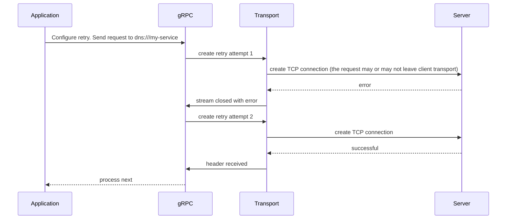

### Overview

Retries are a key pattern for making services more reliable. By re-attempting failed operations, applications can overcome temporary issues like network glitches or server timeouts. This is essential for modern cloud applications to handle the inevitable transient faults that occur.

For the best practice, applications should understand what failed operation is suitable for retry, define exponential backoff parameters for retry delay, determine the number of retry attempts, and also monitor retry metrics.

gRPC takes the stress out of failures with retry policies support, default transparent retry and detailed insights with OpenCensus and OpenTelemetry support.

### How gRPC client retry works

Once enabled (transparent retry is enabled by default, see later sections), gRPC's built-in retry logic saves the call history for potential retries and monitors RPC events. Note that 'retry' means creating a new transport stream when a previous connection attempt failed and replaying the saved calls on the newly created stream.

If certain criteria are met – the RPC closes with a failure status code matching the retry policy's retryable status codes and remains within the retry attempt limit – gRPC will create a new retry stream after an exponential backoff delay.

gRPC also supports other features like retry throttling and server push back. See [gRFC for client side retry] for further details.

Once the response header is received, the connection is considered successful. No further retries will be attempted, and gRPC hands over the RPC to the application.

The graph below shows architectural overview of gRPC retry internal.





### Transparent Retry 
As indicated in the graph above, a failure can occur when the request never leaves the client host. In this case, gRPC performs a transparent retry, which does not count towards the limit of configured RPC attempts. Transparent retries are the default behavior when retry functionality is enabled (which it is by default).

### Retry configuration
Retries are enabled by default. Without a specific retry policy, gRPC will perform a single transparent retry. You can also disable retries entirely.

You can optimize your application's retry functionality by focusing on key steps and configurations that gRPC supports.
* Max number of retry attempts
* Exponential backoff 
* Set of retryable status codes

Retry is configurable via [gRPC Service Config], at a per-method granularity.
  The configuration contains the following knobs:

```
"retryPolicy": {
  "maxAttempts": 4,
  "initialBackoff": "0.1s",
  "maxBackoff": "1s",
  "backoffMultiplier": 2,
  "retryableStatusCodes": [
    "UNAVAILABLE"
  ]
}
```

gRPC prevents server overload due to retries, and throttle limit can be configured:

```
"retryThrottling": {
  "maxTokens": 10,
  "tokenRatio": 0.1
}
```

Further, hedging is a complementary feature to retries and can be configured similarly. For more details, see the [hedging guide].

### Retry Observability

gRPC supports exposing OpenCensus and OpenTelemetry metrics when retry functionality is enabled. Here's an example of the OpenTelemetry retry attempt statistics available:
* `grpc.client.attempt.started`
* `grpc.client.attempt.duration`
* `grpc.client.attempt.sent_total_compressed_message_size`
* `grpc.client.attempt.rcvd_total_compressed_message_size`

Metrics at per cal level:
* `grpc.client.call.duration`
* 
And server side metrics:
* `grpc.server.call.started`
* `grpc.server.call.sent_total_compressed_message_size`
* `grpc.server.call.rcvd_total_compressed_message_size`
* `grpc.server.call.duration`

Find in-depth metrics and tracing information, along with configuration instructions, in the [gRFC for Otel metrics], [gRFC for retry status]. 

### Language guides and examples

| Language | Example          | Documentation        |
|----------|------------------|----------------------|
| C++      |                  |                      |
| Go       | [Go Example]     | 		                   |
| Java     | [Java Example]   | [Java Documentation] |
| Python   | [Python Example] |                      | 


### Additional Resources

* [gRFC for client side retry]
* [gRFC for retry status]
* [Hedging Guide]
* [gRPC Service Config]
* [gRFC for Otel metrics]

[gRFC for client side retry]: https://github.com/grpc/proposal/blob/master/A6-client-retries.md  
[gRFC for retry status]:https://github.com/grpc/proposal/blob/master/A45-retry-stats.md
[Go Example]: https://github.com/grpc/grpc-go/tree/master/examples/features/retry
[Java Example]: https://github.com/grpc/grpc-java/tree/master/examples/src/main/java/io/grpc/examples/retrying
[Python Example]: https://github.com/grpc/grpc/tree/master/examples/python/retry
[Java Documentation]: https://grpc.github.io/grpc-java/javadoc/io/grpc/ManagedChannelBuilder.html#enableRetry()
[Hedging Guide]: https://grpc.io/docs/guides/request-hedging
[gRPC Service Config]: https://github.com/grpc/grpc/blob/master/doc/service_config.md 
[gRFC for Otel metrics]:https://github.com/grpc/proposal/blob/master/A66-otel-stats.md


