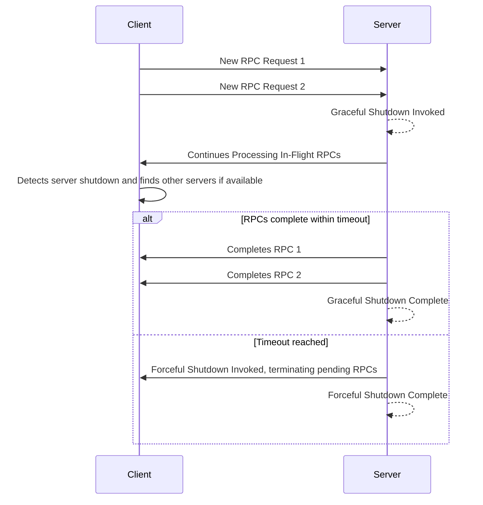
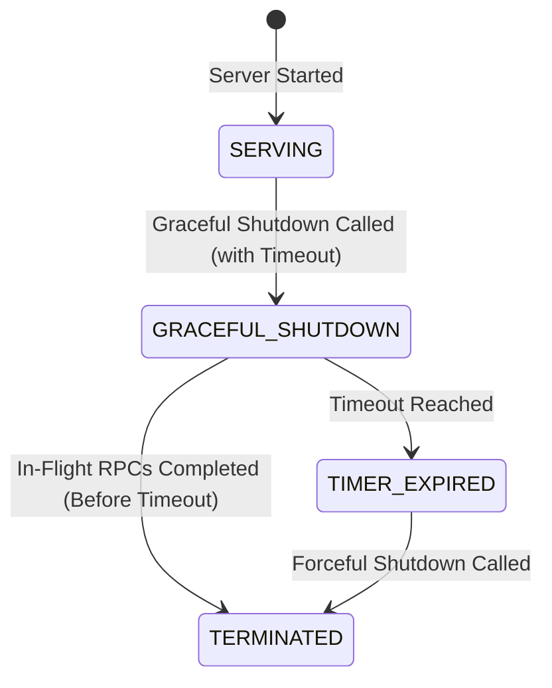

### Overview

gRPC servers often need to shut down gracefully, ensuring that in-flight RPCs
are completed within a reasonable time frame and new RPCs are no longer
accepted. The "Graceful shutdown function" facilitates this process, allowing
the server to transition smoothly without abruptly terminating active
connections.

When the "Graceful shutdown function" is called, the server immediately
notifies all clients to stop sending new RPCs. Then after the clients have
received that notification, the server will stop accepting new RPCs. In-flight
RPCs are allowed to continue until they complete or a specified deadline is
reached. Once all active RPCs finish or the deadline expires, the server shuts
down completely.

Because graceful shutdown helps prevent clients from encountering RPC failures,
it should be used if possible.  However, gRPC also provides a forceful shutdown
mechanism which will immediately cause the server to stop serving and close all
connections, which results in the failure of any in-flight RPCs.

### How to do Graceful Server Shutdown

The exact implementation of the "Graceful shutdown function" varies depending on
the programming language you are using. However, the general pattern
involves:

- Initiating the graceful shutdown process by calling the "Graceful shutdown
  function" on your gRPC server object. This function blocks until all
  currently running RPCs complete. This ensures that in-flight requests are
  allowed to finish processing.
- Specify a timeout period to limit the time allowed for in-progress RPCs to
  finish. It's crucial to separately call the "Forceful shutdown function" on
  the server object using a timer mechanism (depending on your language) to
  trigger a forceful shutdown after a predefined duration. This
  acts as a safety net, ensuring that the server eventually shuts down even if
  some in-flight RPCs don't complete within a reasonable time frame. This
  prevents indefinite blocking.

The following shows the sequence of events that occur during the graceful
shutdown process. When a server's graceful shutdown is invoked, in-flight RPCs
continue to process, but new RPCs are rejected. If some in-flight RPCs are not
finished in time, the server is forcefully shut down.

The following is a state based view

### Language Support

| Language | Example          |
|----------|------------------|
| C++      |                  |
| Go       | [Go Example]     |
| Java     | [Java Example]   |
| Python   |                  |

[Go example]: https://github.com/grpc/grpc-go/tree/master/examples/features/gracefulstop
[Java example]: https://github.com/grpc/grpc-java/tree/master/examples/example-hostname/src/main/java/io/grpc/examples/hostname
