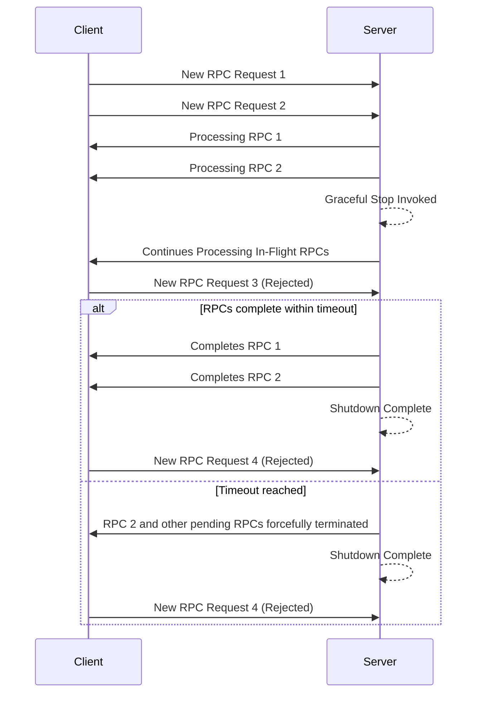
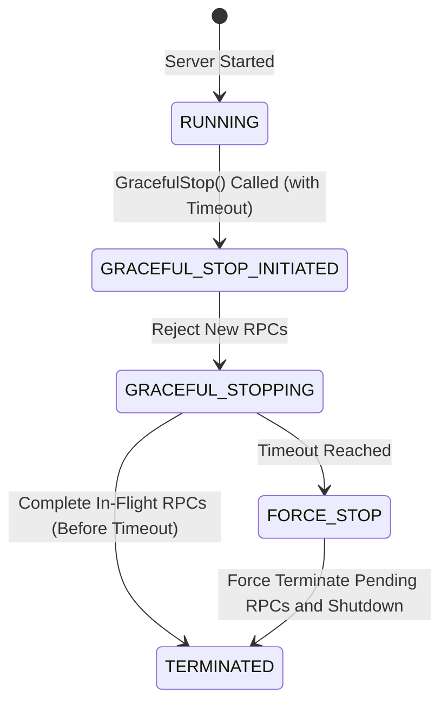

### Overview

gRPC servers often need to shut down gracefully, ensuring that in-flight RPCs
are completed within a reasonable timeframe and new RPCs are no longer
accepted. "Graceful shutdown function" facilitates this process, allowing the server to
transition smoothly without abruptly terminating active connections.

When "Graceful shutdown function" is called, the server immediately stops accepting new
RPCs. In-flight RPCs are allowed to continue until they complete or a specified
deadline is reached. Once all active RPCs finish or the deadline expires, the
server shuts down completely.

### How to use Wait-for-Ready

The exact implementation of "Graceful shutdown function" varies depending on the
programming language you are using. However, the general pattern
involves:

- Initiating the graceful shutdown process by calling "Graceful shutdown
  Function" on your gRPC server object. This function blocks until all
  currently running RPCs completed. This ensures that in-flight requests are
  allowed to finish processing.
- Specify a timeout period to limit the time allowed for in-progress RPCs to
  finish. It's crucial to call "Forceful Shutdown Function" on server object
  with a timeout before calling "Graceful shutdown function". This acts as a
  safety net, ensuring that the server eventually shuts down even if some
  in-flight RPCs don't complete within a reasonable timeframe. This prevents
  indefinite blocking.

The following shows the sequence of events that occur, when a server graceful
stop is invoked, in-flight RPCs continue to prorcess but new RPCs are rejected.
If all in-flight RPCs are not finished in time, server is forcefully shutdown.

The following is a state based view

### Alternatives

- Forceful Shutdown: Immediately terminates the server using "Forceful Shutdown
  Function" on server object, potentially interrupting active RPCs and leading
  to errors on the client-side. Use only as a last resort.

### Language Support

| Language | Example           |
|----------|-------------------|
| Java     |                   |
| Go       | [Go example]      |
| Python   |                   |

[Go example]: https://github.com/grpc/grpc-go/tree/master/examples/features/gracefulstop
