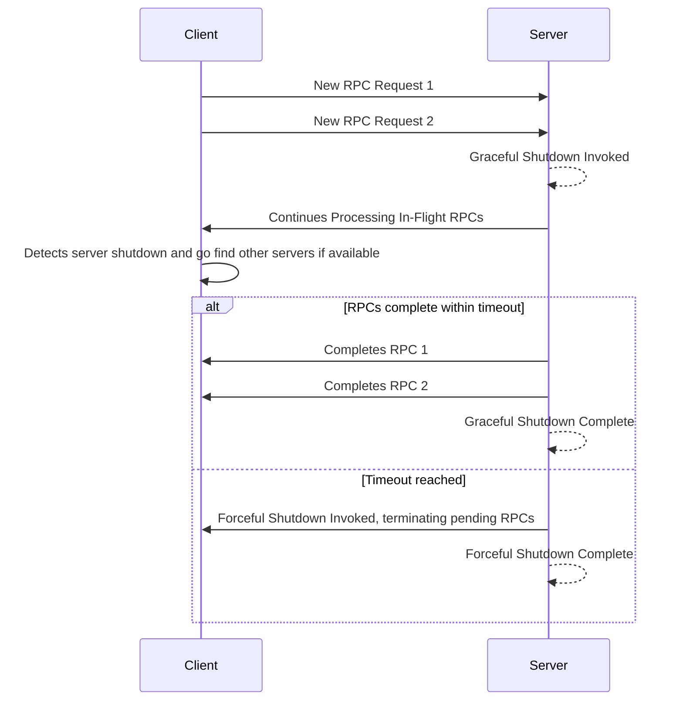

### Overview

gRPC servers often need to shut down gracefully, ensuring that in-flight RPCs
are completed within a reasonable timeframe and new RPCs are no longer
accepted. The "Graceful shutdown function" facilitates this process, allowing
the server to transition smoothly without abruptly terminating active
connections.

When the "Graceful shutdown function" is called, the server immediately stops
accepting new RPCs. In-flight RPCs are allowed to continue until they complete
or a specified deadline is reached. Once all active RPCs finish or the deadline
expires, the server shuts down completely.

While a graceful shutdown is optional, it's highly recommended. You can
shutdown without a graceful shutdown first but that would not be recommended.

### How to do Graceful Server Shutdown

The exact implementation of the "Graceful shutdown function" varies depending on
the programming language you are using. However, the general pattern
involves:

- Initiating the graceful shutdown process by calling "Graceful shutdown
  function" on your gRPC server object. This function blocks until all
  currently running RPCs complete. This ensures that in-flight requests are
  allowed to finish processing.
- Specify a timeout period to limit the time allowed for in-progress RPCs to
  finish. It's crucial to separately call the "Forceful shutdown function" on
  the server object using a timer mechanism (depending on your language) to
  trigger a forceful shutdown after a predefined duration. This
  acts as a safety net, ensuring that the server eventually shuts down even if
  some in-flight RPCs don't complete within a reasonable timeframe. This
  prevents indefinite blocking.

The following shows the sequence of events that occur, when a server's graceful
stop is invoked, in-flight RPCs continue to prorcess, but new RPCs are
rejected. If some in-flight RPCs are not finished in time, server is forcefully
shutdown.

The following is a state based view

### Language Support

| Language | Example           |
|----------|-------------------|
| Java     | [Java example]    |
| Go       | [Go example]      |
| Python   |                   |

[Go example]: https://github.com/grpc/grpc-go/tree/master/examples/features/gracefulstop
[Java example]: https://github.com/grpc/grpc-java/tree/master/examples/example-hostname/src/main/java/io/grpc/examples/hostname
