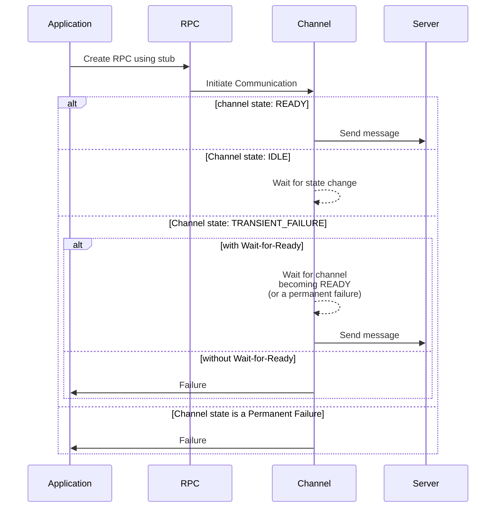
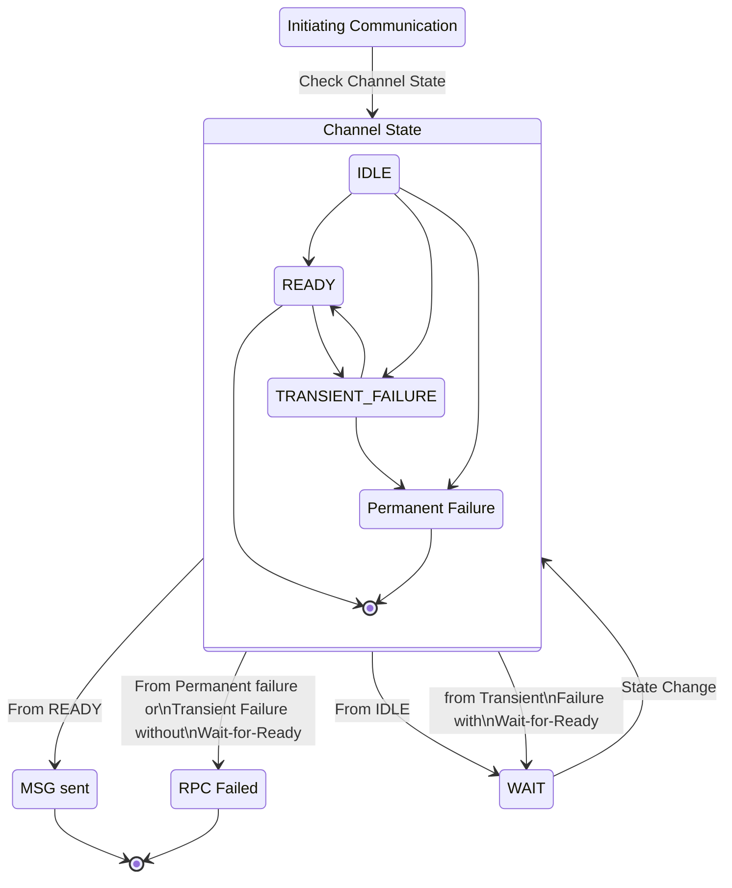

### Overview

This is a feature which can be used on a stub which will cause the RPCs to wait
(until an optional deadline is exceeded) for the server to become available
before sending the request.  This allows for robust batch workflows as transient server problems
(including startup) won't cause failures.

When an RPC is created while the channel is not in a READY state, without
waitForReady it will immediately return a failure; with waitForReady it will
simply block until the connection becomes ready.  The default is **without**
Wait-for-Ready.

For detailed semantics see [this][grpc doc].

### How to use Wait-for-Ready

You can specify for a stub whether or not it should use Wait-for-Ready which
will automatically be passed along, when an RPC is created, to the associated
stream.

{}
 The RPC can still fail for other reasons besides the server not being
ready, so error handling is still necessary.
{}

The following shows the sequence of events the occur, when a client sends a
message to a server, based upon channel state and whether or not Wait-for-Ready
is set.

### Alternatives

- Loop until RPC stops returning transient failures.
- Implement an `onReady` Handler and handle your own blocking _(for languages that
  support this)_

### Language Support

| Language | Example           |
|----------|-------------------|
| Java     | [Java example]    |
| Go       | [Go example]      |
| Python   | [Python example]  |

[Java example]: https://github.com/grpc/grpc-java/blob/master/examples/src/main/java/io/grpc/examples/waitforready/WaitForReadyClient.java
[Go example]: https://github.com/grpc/grpc-go/tree/master/examples/features/name_resolving
[Python example]: https://github.com/grpc/grpc/tree/master/examples/python/wait_for_ready
[grpc doc]: https://github.com/grpc/grpc/blob/master/doc/wait-for-ready.md
