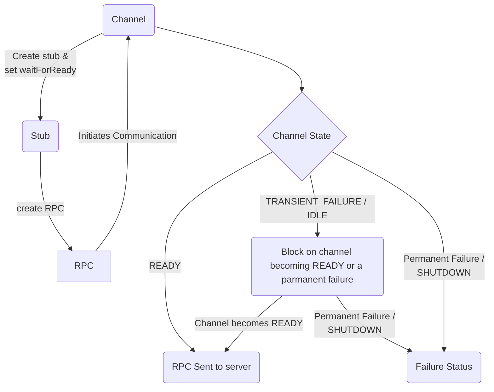

### Overview

This is a feature which can be used on a stub which will cause the rpcs to wait
(until an optional deadline is exceeded or) for the server to become available
before sending the request.

This is useful for batch workflows where there is no need to fail fast as it
allows simplifying the implementation by hiding transient failures.

When an RPC is created while the channel is not in a READY state, without
waitForReady it will immediately return a failure; with waitForReady it will
simply block until the connection becomes ready.

For detailed semantics see:  [grpc/doc/wait-for-ready.md][grpc doc]

### How to use Wait for Ready

waitForReady is an attribute associated with a stub. When an RPC is created, the
wait for ready attribute is automatically provided to the associated stream.

Warning:  the RPC can still fail for other reasons than the server not being
ready, so you must still implement error handline.

### Alternatives

- Loop until RPC stops returning transient failures.
- Implement an onReady Handler and handle your own blocking _(for languages that
  support this)_

### Language Support

| Language | Example          | Notes            |
|----------|------------------|------------------|
| Java     | [Java example]   |                  |
| Go       | [Go example]     |                  |
| C++      |                  | Example upcoming |
| Python   | [Python example] |                  |
| Node     |                  | Example upcoming |

[Java example]: https://github.com/grpc/grpc-java/blob/master/examples/src/main/java/io/grpc/examples/waitforready/WaitForReadyClient.java

[Go example]: https://github.com/grpc/grpc-go/tree/master/examples/features/name_resolving

[Python example]: https://github.com/grpc/grpc/tree/master/examples/python/wait_for_ready

[grpc doc]: https://github.com/grpc/grpc/blob/master/doc/wait-for-ready.md